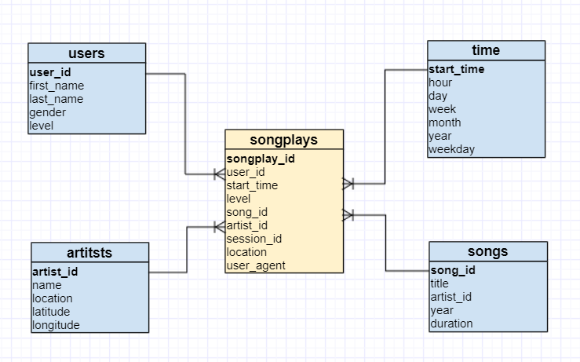

# Data Pipelines with Apache Airflow

Automated data pipeline workflows using [Apache Airflow](https://airflow.apache.org/) that loads and processes data from Amazon S3 into an [Amazon Redshift](https://aws.amazon.com/redshift/) cloud data warehouse for analytics processing.

## Background

The analytics team for music streaming startup Sparkify wants to automate and better monitor their data warehouse ETL pipelines using the Apache Airflow open-source workflow management platform.

## Objective
The goal of this project is to author a data pipeline workflow created with custom operators within the Airflow platform that perform tasks such as staging data, populating the data warehouse, and running quality checks.  The end result will be a pipeline defintion as illustrated below.


The pipeline transforms the data into a set of fact and dimension tables in Redshift.



## Custom operators

The project includes reuseable operators that have been implemented into functional pieces of the data pipeline.

### Stage operator

Loads JSON formatted files from S3 into Redshift by running a SQL COPY statement based on parameter values for the S3 bucket and target Redshift table.

### Fact operator

Loads output data from the stage operator into a fact table.  SQL statement and target table are passed as parameters.

### Dimension operator

Loads data from the fact table into dimension tables.  SQL statement and target table are passed as parameters.

### Data quality operator

Runs qualtiy checks on the transformed data. 

## Project files

In addition to files for implementing the above operator functionality, the project also includes:

- `sparkify_workflow_dag.py` - DAG (Directed Acyclic Graph) definition script
- `redshift.ipynb` - [Jupyter Notebook](https://jupyter.org/) for creating the Redshift cluster
- `create_tables.sql` - SQL for creating Redshift tables
- `sql_queries.py` - script with SQL for operators to import data
- `dwh.cfg` - configuration values for AWS services

## Steps to run project

1. Execute the steps in the Jupyter Notebook to create the Redshift cluster

    An AWS IAM user with the following policies (or equivalent permissions) is required:
    - AmazonRedshiftFullAccess
    - AmazonS3ReadOnlyAccess
    - IAMFullAccess
    - AmazonEC2FullAccess

    The access key and secret key need to be added to the `[AWS]` section in the `dwh.cfg` file.

```
[AWS]
KEY=YOURACCESSKEYGOESHERE
SECRET=PUTyourSECRETaccessKEYhereTHISisREQUIRED
```

2. Run queries in `create_tables.sql`

3. Start Airflow and toggle "ON" the DAG named <b>sparkify_workflow</b>